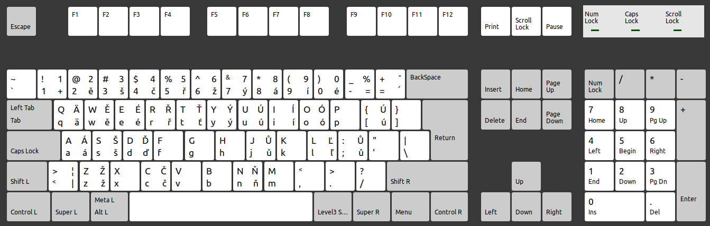

# Háčkoviny

English programming keyboard layout with cleverly hidden Czechoslovak diacritics (in plane sight).

It always slowed my writing, when I switched in between Czech and English keyboard layouts, to write with české diacritics. Not anymore - just press `AltGr + s` to get `š`, or `AltGr + Shift + S` to get `Š`, or `AltGr + Shift + D` to get `Ď`. You know the drill.

Created by gr4viton. (I also have a windows version of this keyboard layout, from back in the day)

## Layout

TLDR: Press AltGr + letter without diacritics, and you get the letter with Czech diacritics. Works with shift capital letters too!



## Compatibility

Tested on:
- Linux Mint 21
- Ubuntu 24.04

## Install

### Step 1: Copy Layout File
```bash
# Copy the layout file to system location
sudo cp en_haczkoviny /usr/share/X11/xkb/symbols/
```

### Step 2: Register Layout in XML Database
Add this layout config to `/usr/share/X11/xkb/rules/evdev.xml`:

```bash
sudo nano /usr/share/X11/xkb/rules/evdev.xml
```

Find the `<layoutList>` section and add (sort alphabetically near English layouts):
```xml
<layout>
  <configItem>
    <name>en_haczkoviny</name>
    <shortDescription>haczkoviny</shortDescription>
    <description>English (haczkoviny)</description>
    <languageList>
      <iso639Id>eng</iso639Id>
      <iso639Id>cze</iso639Id>
      <iso639Id>slo</iso639Id>
    </languageList>
  </configItem>
</layout>
```

### Step 3: Register Layout in LST Database
Add to `/usr/share/X11/xkb/rules/evdev.lst`:

```bash
sudo nano /usr/share/X11/xkb/rules/evdev.lst
```

Find the `! layout` section and add:
```
  en_haczkoviny    English (haczkoviny)
```

### Step 4: Update XKB Cache
```bash
sudo dpkg-reconfigure xkb-data
```


### Make sure the AltGr is selected

- Ubuntu 24 
  - settings - Keyboard - Special Character Entry - Alternate Characters Key - Right Alt

### Use the keyboard layout

- Linux Mint 
  - menu - Keyboard - Layouts - [+] button - search `hackoviny` - select `English with háčkoviny (hackoviny)` - Add - Switch to it - Profit $$$!
- Ubuntu 24
  - settings - Keyboard - Input sources - Add input Source... - search `hackoviny` - select - Add - Switch to it - Profit $$$!


## License

Copyright (C) 2010 gr4viton

This keyboard layout is free software: you can redistribute it and/or modify
it under the terms of the GNU General Public License as published by
the Free Software Foundation, version 3.

Additional requirement: Any use must prominently credit gr4viton as the original creator.
